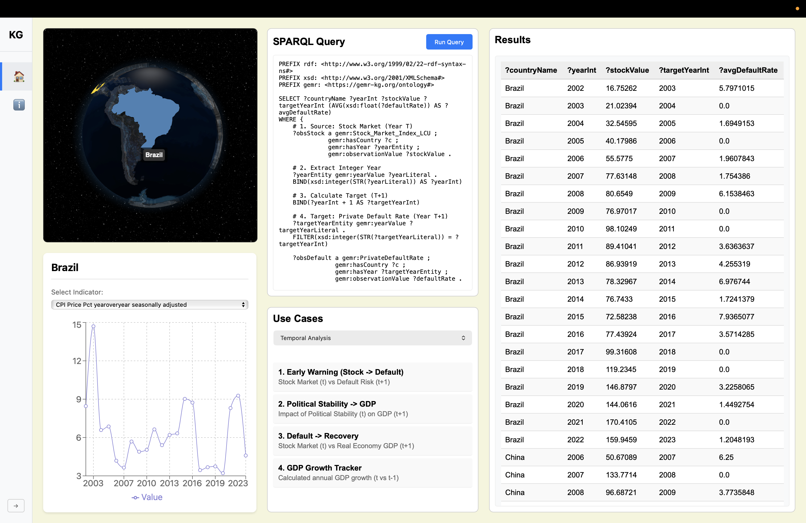

# GEMR:KG - Global Emerging Markets Risk Knowledge Graph

The Goal of the project is to construct a knowledge graph and publish a research paper out of it.

## UI Screenshot



# Datasets

1. World Bank : Global Economic Monitor

```
https://datacatalog.worldbank.org/search/dataset/0037798/Global-Economic-Monitor

```

2. World Bank : Global Emerging Markets Risk Database

```
https://data360.worldbank.org/en/dataset/IFC_GEM
```

3. World Bank : Worldwide Governance Indicators

```
https://www.worldbank.org/en/publication/worldwide-governance-indicators

```

# Goal

The World Bank provides the Global Economic Monitor (GEM) dataset. Existing visualizations for the GEM dataset can be found at
the following link: [https://databank.worldbank.org/source/global-economic-monitor-(gem)](https://databank.worldbank.org/source/global-economic-monitor-(gem)).

The world bank also provides a governance indicators scores : [https://www.worldbank.org/en/publication/worldwide-governance-indicators/interactive-data-access]()

Similarly, another dataset exists called the Global Emerging Markets (GEMs) Risk Database. However, visualizations for this emerging market risk dataset are not currently available.

Our tool is designed to combine the three datasets and harness the power of knowledge graphs to facilitate visualization, and answer complex analytical questions.

# Key Files

1. **Ontology File**: [ontology/final-gemr-fibo-reasoned.owl](./ontology/final-gemr-fibo-reasoned.owl) - The OWL ontology defining the GEMR-KG structure
2. **TTL File**: [Final_GEMR_Submission.ttl](./Final_GEMR_Submission.ttl) - The RDF triple data in Turtle format

# Backend Setup

## GraphDB Docker Setup

This guide explains how to build and run the custom GraphDB Docker image with the preloaded GEMR repository.

### Prerequisites
- Docker installed
- `endPoint/test1.zip` present in the project root
- `config.ttl` present in the project root

### 1. Build the Image
Run this command from the directory containing the `Dockerfile`:

```bash
docker build -t my-graphdb-image .
```

### 2. Run the Container

#### Option A: Detached Mode (Background)
Use this for normal operation. The container runs in the background.

```bash
docker run -d -p 7200:7200 --name graphdb-instance my-graphdb-image
```

#### Option B: Attached Mode (Interactive)
Use this to see logs in real-time. Press `Ctrl+C` to stop.

```bash
docker run -p 7200:7200 --name graphdb-instance my-graphdb-image
```

### 3. Access GraphDB
- **Workbench**: [http://localhost:7200](http://localhost:7200)
- **SPARQL Endpoint**: [http://localhost:7200/repositories/GEMR](http://localhost:7200/repositories/GEMR)

### 4. Stop and Remove
To stop and remove the container (needed if you want to run it again with the same name):

```bash
docker rm -f graphdb-instance
```

### 5. Remove the Image
To remove the image (needed if you want to rebuild it):

```bash
docker rmi my-graphdb-image
```

# Frontend Setup

## Frontend Web Application

This project is a React-based frontend that visualizes economic data on an interactive 3D globe. It connects to a local GraphDB instance to fetch and display real-time statistics for selected countries.

### Features
- **Interactive Globe**: 3D visualization using `react-globe.gl`.
- **Country Selection**: Highlights and allows selection of Brazil, China, Mexico, Philippines, Poland, and Thailand.
- **Data Visualization**: Displays economic indicators (e.g., CPI, Default Rates) using interactive line charts (`recharts`).
- **SPARQL Integration**: Fetches data dynamically from a local GraphDB repository.

### Prerequisites
1. **Node.js**: Ensure Node.js is installed.
2. **Docker**: You must have the GraphDB Docker container running.

### Startup Instructions

#### 1. Start GraphDB (Docker)
The frontend relies on the GraphDB backend. Make sure the container is running on port 7200.

```bash
# Run the custom GraphDB image (detached mode)
docker run -d -p 7200:7200 --name graphdb-instance my-graphdb-image
```

#### 2. Start the Frontend
Navigate to the `frontend` directory and start the development server.

```bash
cd frontend
npm install  # Install dependencies (only needed once)
npm run dev
```

#### 3. Access the App
Open your browser and go to the URL shown in the terminal (usually `http://localhost:5173`).

### Usage
1. **Select a Country**: Click on a highlighted country (Gold color) on the globe.
2. **View Stats**: The panel below the globe will populate with a line chart showing economic data.
3. **Change Indicator**: Use the dropdown menu to switch between different economic indicators.