# Visual Relationship Diagrams

This document provides visual representations of the data structures and relationships in the GEMR-KG project.

---

## 1. Dataset Overview

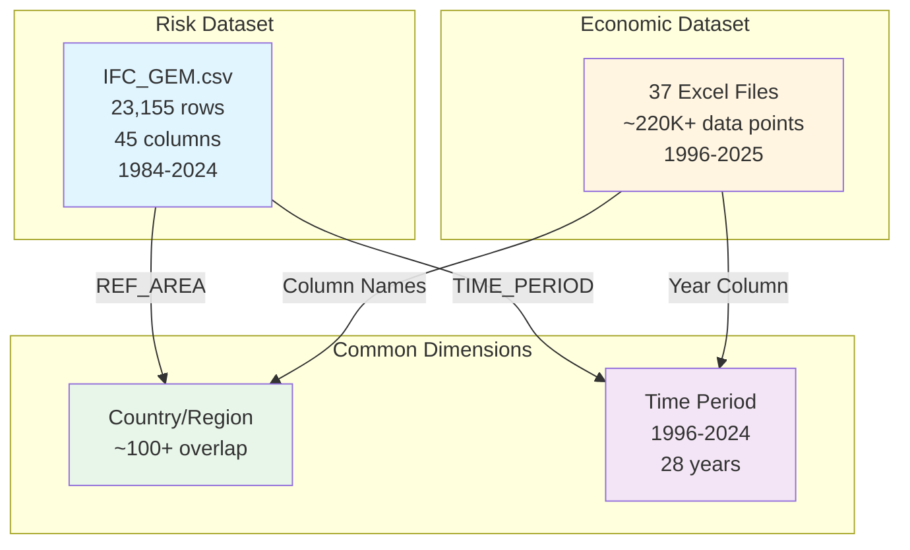

---

## 2. Risk Dataset Structure

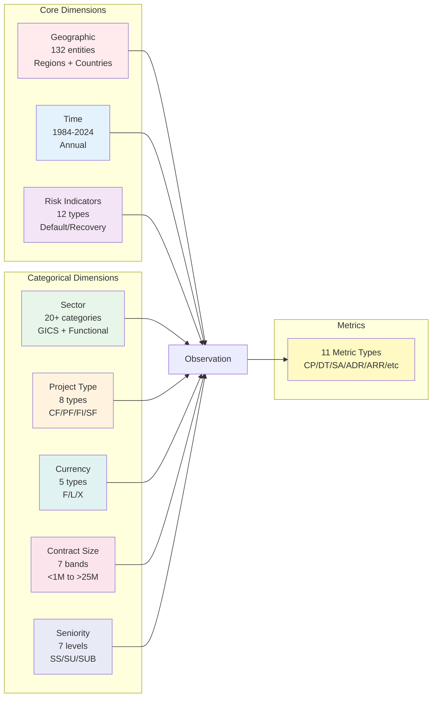

---

## 3. Economic Dataset Structure

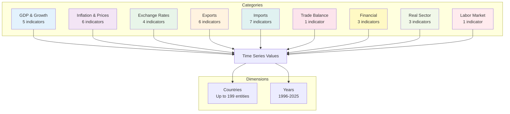

---

## 4. Geographic Hierarchy

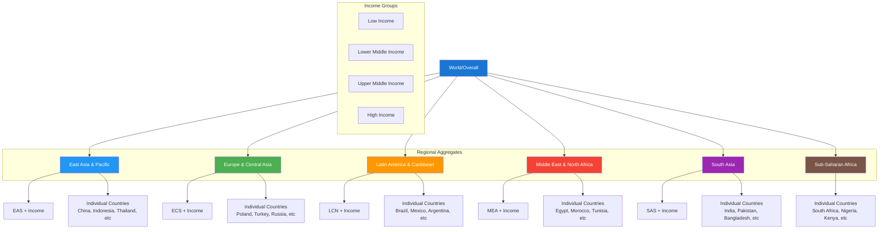

---

## 5. Risk Indicator Types

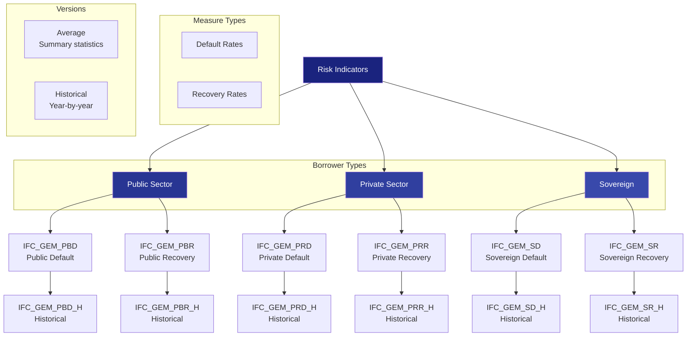

---

## 6. Key Relationships: Economic → Risk

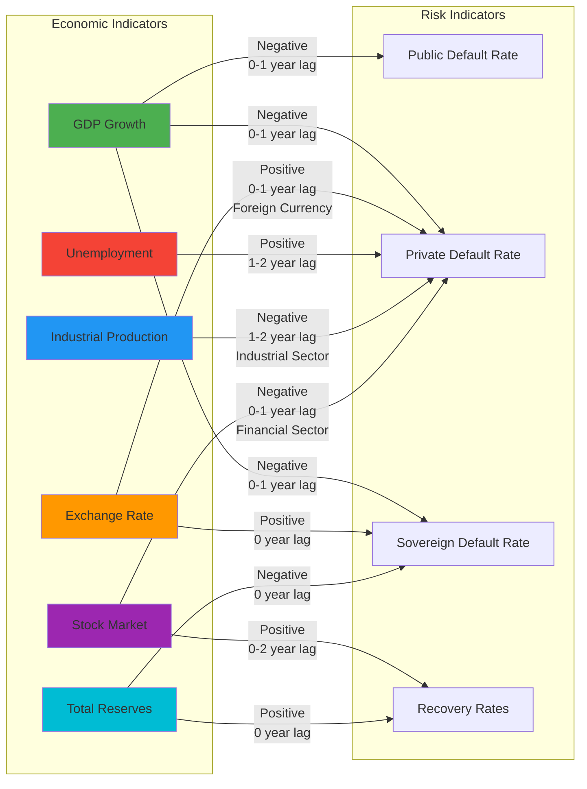

---

## 7. Sector-Specific Relationships

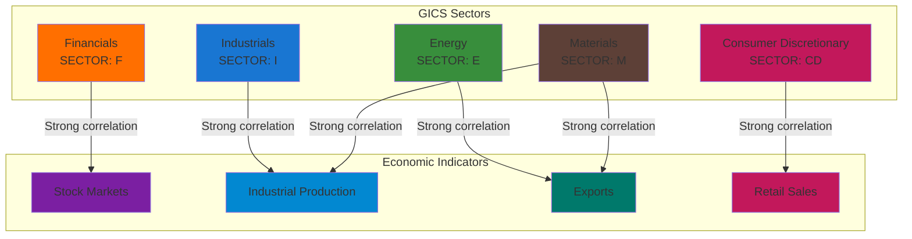

---

## 8. Currency Type Analysis

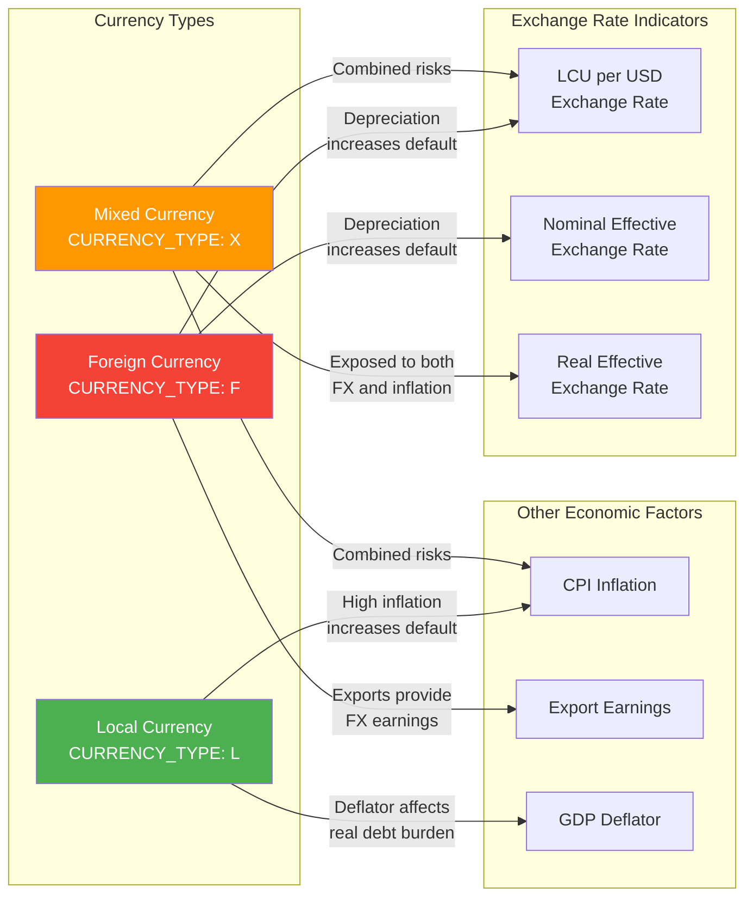

---

## 9. Project Type Classification

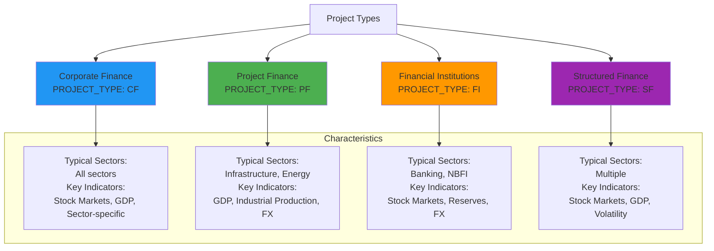

---

## 10. Contract Size Distribution

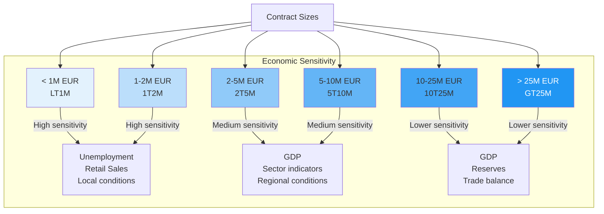

---

## 11. Knowledge Graph Schema

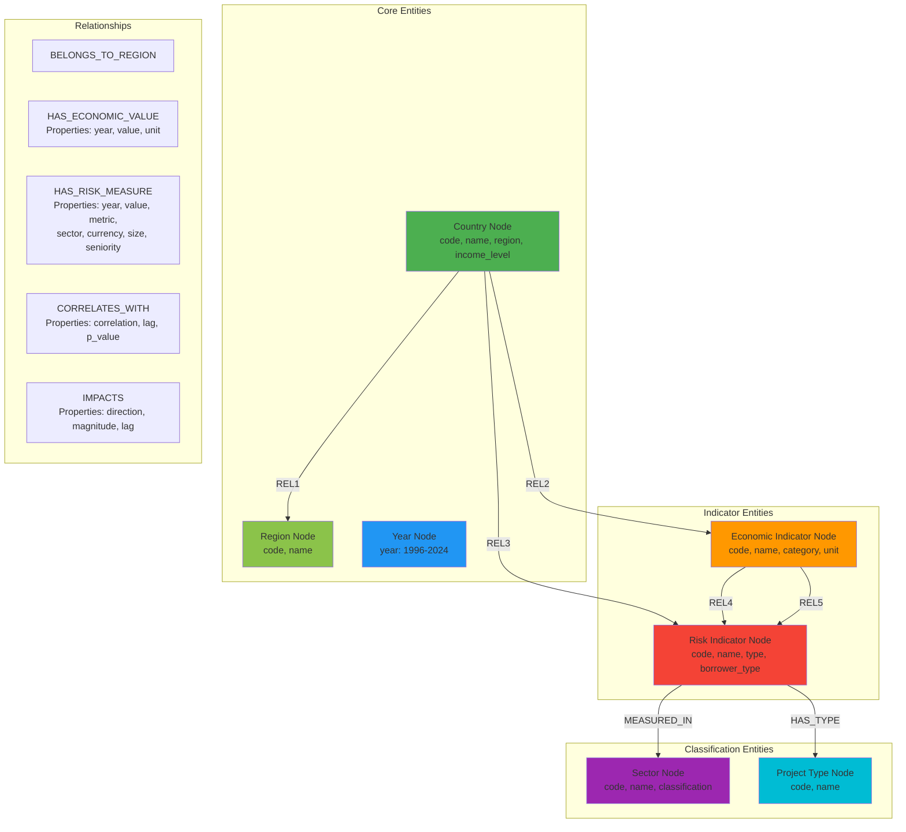

---

## 12. Time Lag Structure

```mermaid
gantt
    title Leading and Lagging Indicators
    dateFormat X
    axisFormat %s
    
    section Economic Shock
    GDP Decline          :milestone, m1, 0, 0
    Exchange Rate Shock  :milestone, m2, 0, 0
    Unemployment Rise    :milestone, m3, 0, 0
    
    section Immediate Impact (0 year)
    Sovereign Defaults   :active, s1, 0, 1
    FX-denominated Defaults :active, s2, 0, 1
    Stock Market Crash   :active, s3, 0, 1
    
    section Short-term (1 year lag)
    Public Defaults      :active, l1, 1, 2
    Financial Sector Defaults :active, l2, 1, 2
    Overall Private Defaults :active, l3, 1, 2
    
    section Medium-term (2 year lag)
    Industrial Sector Defaults :active, m1, 2, 3
    Consumer Sector Defaults :active, m2, 2, 3
    Recovery Rates Bottom :active, m3, 2, 3
    
    section Long-term (3+ years)
    Recovery Rate Improvement :done, r1, 3, 5
    Risk Normalization   :done, r2, 4, 6
```

---

## 13. Regional Risk Profiles

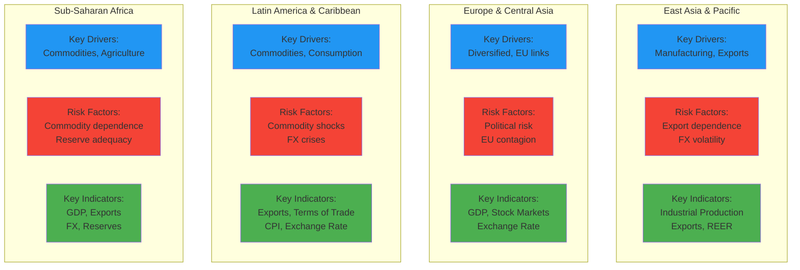

---

## 14. Analysis Flow

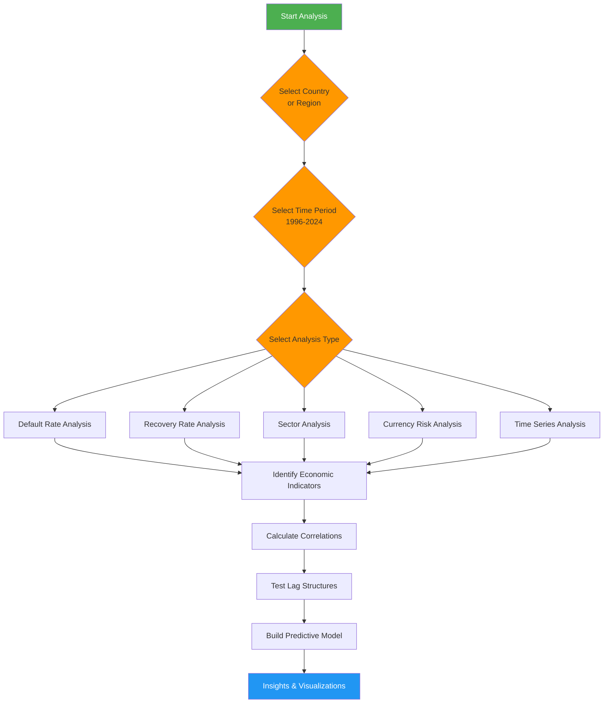

---

## 15. Implementation Phases

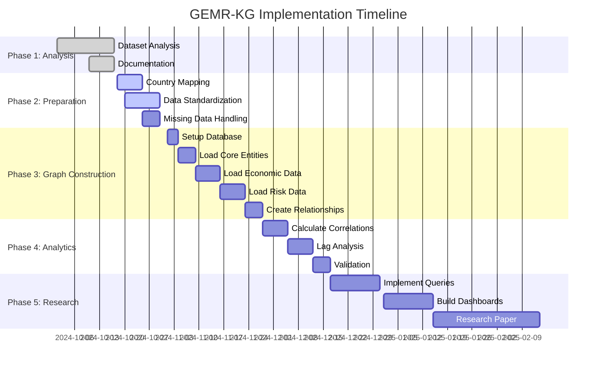

---

## Notes on Diagrams

These diagrams are rendered using Mermaid syntax, which is supported by:
- GitHub (native support in markdown files)
- GitLab (native support)
- Many markdown editors (VS Code with Mermaid extension, Typora, etc.)
- Mermaid Live Editor: https://mermaid.live/

If viewing in a tool that doesn't support Mermaid, you can:
1. Copy the code blocks to https://mermaid.live/ for rendering
2. Use a Mermaid-compatible markdown viewer
3. Export to PNG/SVG from the Mermaid Live Editor

---

## Diagram Legend

### Node Colors by Type
- **Blue shades**: Geographic/temporal dimensions
- **Green shades**: Economic indicators
- **Red/Orange shades**: Risk indicators
- **Purple shades**: Financial/market indicators
- **Brown/Gray shades**: Administrative/classification

### Relationship Arrows
- **Solid arrows**: Direct relationships
- **Dashed arrows**: Derived/computed relationships
- **Arrow labels**: Describe the nature of the relationship (correlation direction, lag)

### Layout Patterns
- **Top-to-bottom**: Hierarchical relationships
- **Left-to-right**: Causal or temporal flows
- **Clustered subgraphs**: Logical groupings

---

*End of Visual Relationships Document*

